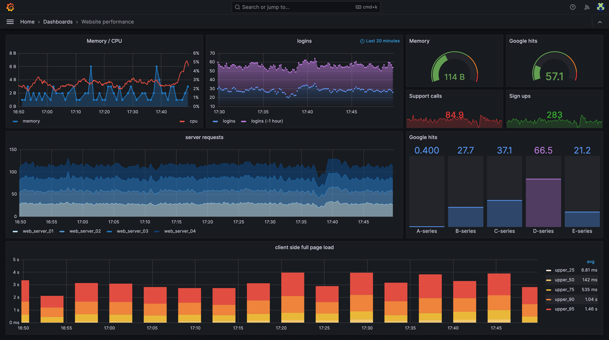
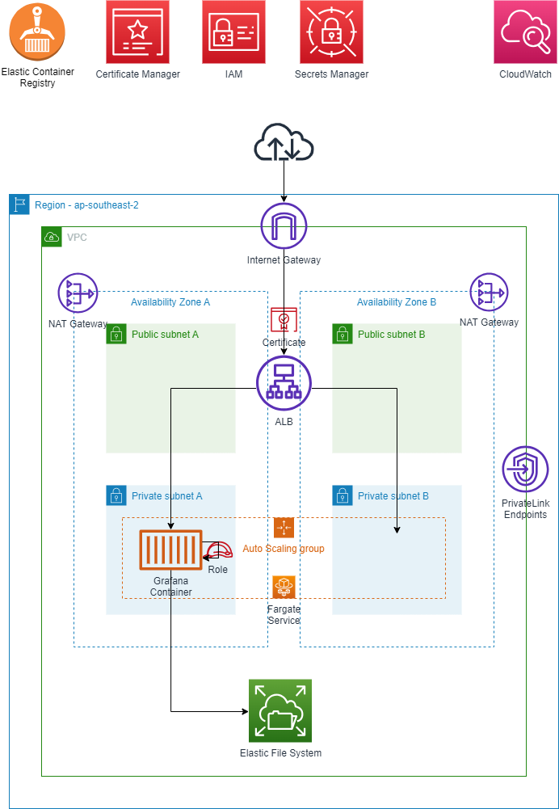

# Grafana Enterprise



## Summary
This project aims to deploy a resilient Grafana container on [AWS Fargate](https://aws.amazon.com/fargate/) using the [Grafana Enterprise Docker Image](https://grafana.com/docs/grafana/latest/installation/docker/).

In this solution, Grafana Enterpise is privately hosted using a Docker container application on Amazon Elastic Container Service (Amazon ECS) behind a Network Load Balancer, and the application accessed using AWS PrivateLink. You can then use a private network to securely access services on the Amazon Web Services (AWS) Cloud. Amazon Elastic File System (Amazon EFS) is used if the application requires persistent storage.

* [Terraform](https://www.terraform.io/) is used for infrastructure-as-code and deployment.  
* Persistance is provided by [Amazon EFS and AWS Fargate support](https://aws.amazon.com/about-aws/whats-new/2020/04/amazon-ecs-aws-fargate-support-amazon-efs-filesystems-generally-available/).  
* High Availability is supported but Autoscaling of the container is not provided at this point i.e. the ECS/Fargate service will ensure that only **one** Grafana container is online between Availability Zone A or B. 
* Access for the Grafana container to CloudWatch is configured with an IAM Role, preventing the need to configure Access/Secret keys
* The initial admin password is securely generated and configured using [Secrets Manager](https://console.aws.amazon.com/secretsmanager)
* A TLS certificate is automatically created deployed to the Application Load Balancer using [AWS Certificate Manager](https://aws.amazon.com/certificate-manager/) enabling secure HTTPS Only communication with the Grafana portal
* PrivateLink endpoints can be added for increased security

## System Diagram
* Access to Grafana dashboards - via internet or internal network?



## Prerequisites

### Git
* Install [git](https://git-scm.com/book/en/v2/Getting-Started-Installing-Git)
 
### AWS
* An AWS account
* [AWS CLI](https://docs.aws.amazon.com/cli/latest/userguide/install-cliv2.html)
* AWS CLI [configured](https://docs.aws.amazon.com/cli/latest/userguide/cli-configure-quickstart.html#cli-configure-quickstart-config)
* [Terraform](#)

## Download and Configure

### Clone Repo
```bash
git clone https://github.com/aws-samples/aws-cdk-grafana
```

### Install node modules
```bash 
cd aws-cdk-grafana
npm install
```

## AWS requirements
Grafana Enterprise requires these AWS resources:
* Amazon CloudWatch
* EFS (Elastic File System)
* AWS KMS
* AWS Secrets Manager
* AWS Elastic Container Registry
* AWS IAM role - ECS task role

## Hardware recommendations
Grafana requires the minimum system resources:
* Minimum recommended memory: 512 MB
* Minimum recommended CPU: 1

Some features might require more memory or CPUs, including:
* Server side rendering of images
* Alerting
* Data source proxy

## PrivateLink Endpoints
PrivateLink endpoints can be added using the following command. This will incur additional cost for the endpoints, but will prevent Amazon CloudWatch, EFS (Elastic File System) and Secrets Manager traffic from traversing the public internet.


## AWS IAM - ECS Task Role

Role name: application-observability-ecs-grafana-enterprise
Description: Allows ECS to create and manage AWS resources on your behalf.

### AWS IAM - ECS Task Role - Trust Policy

```json
{
    "Version": "2008-10-17",
    "Statement": [
        {
            "Sid": "",
            "Effect": "Allow",
            "Principal": {
                "Service": "ecs-tasks.amazonaws.com"
            },
            "Action": "sts:AssumeRole",
            "Condition": {
                "ArnLike": {
                    "aws:SourceArn": "arn:aws:ecs:ap-southeast-2:851725631136:*"
                },
                "StringEquals": {
                    "aws:SourceAccount": "851725631136"
                }
            }
        }
    ]
}
```

### AWS IAM - ECS Task Role - Permissions (TODO: reduce for production)

AWS managed policy
* AmazonEC2ContainerServiceRole
* AmazonSSMManagedInstanceCore
* SecretsManagerReadWrite (TODO: reduce for production)
* CloudWatchFullAccess (TODO: reduce for production)

AWS custom policy
```json
{
	"Version": "2012-10-17",
	"Statement": [
		{
			"Effect": "Allow",
			"Action": [
				"ssm:GetParameters",
				"secretsmanager:GetSecretValue"
			],
			"Resource": [
				"arn:aws:ssm:ap-southeast-2:851725631136:parameter/grafanaEnterprise*",
				"arn:aws:secretsmanager:ap-southeast-2:851725631136:secret:grafanaEnterprise*"
			],
			"Condition": {
				"ArnLike": {
					"aws:SourceArn": "arn:aws:ecs:ap-southeast-2:851725631136:*"
				},
				"StringEquals": {
					"aws:SourceAccount": "851725631136"
				}
			}
		},
		{
			"Effect": "Allow",
			"Action": [
				"cloudwatch:Describe*",
                "cloudwatch:Get*",
				"cloudwatch:List*",
                "ec2:Describe*",
                "tag:GetResources"
			],
			"Resource": ["*"],
		}
	]
}
```

### AWS IAM - ECS Execution Role - Permissions (TODO: reduce for production)

AWS managed policy
* AmazonEC2ContainerServiceRole
* AmazonSSMManagedInstanceCore
* SecretsManagerReadWrite (TODO: reduce for production)
* CloudWatchFullAccess (TODO: reduce for production)

AWS custom policy
```json
{
	"Version": "2012-10-17",
	"Statement": [
		{
			"Effect": "Allow",
			"Action": [
				"ssm:GetParameters",
				"secretsmanager:GetSecretValue"
			],
			"Resource": [
				"arn:aws:ssm:ap-southeast-2:851725631136:parameter/grafanaEnterprise*",
				"arn:aws:secretsmanager:ap-southeast-2:851725631136:secret:grafanaEnterprise*"
			],
			"Condition": {
				"ArnLike": {
					"aws:SourceArn": "arn:aws:ecs:ap-southeast-2:851725631136:*"
				},
				"StringEquals": {
					"aws:SourceAccount": "851725631136"
				}
			}
		},
		{
			"Effect": "Allow",
			"Action": [
				"cloudwatch:Describe*",
                "cloudwatch:Get*",
				"cloudwatch:List*",
                "ec2:Describe*",
                "tag:GetResources"
			],
			"Resource": ["*"],
		}
	]
}
```


## Pushing the Grafane Enterprise Docker image to an Amazon ECR private repository

```bash
aws ecr get-login-password --region ap-southeast-2 | docker login --username AWS --password-stdin 851725631136.dkr.ecr.ap-southeast-2.amazonaws.com
```

```bash
docker run -d -p 3000:3000 --name=grafana grafana/grafana-enterprise
```

```bash
docker images
docker tag grafana/grafana-enterprise:latest 851725631136.dkr.ecr.ap-southeast-2.amazonaws.com/observability-hub:latest
docker push 851725631136.dkr.ecr.ap-southeast-2.amazonaws.com/observability-hub:latest
```

## Deploy Grafana Enterprise on Amazon ECS

### Create an AWS KMS Key
* Key type: Symmetric
* Key usage: Encrypt and decrypt
* Key material origin: KMS
* Regionality: Single-Region key
* Alias: observability-hub-grafana
* Description: observability-hub-grafana
* Tags: add required tags
* Key administrators: select admins
* Key deletion: Allow key administrators to delete this key.
* Key users: AWSServiceRoleForECS
* Review
* Finish

### AWS Variables
```bash
cat > ./output/aws-configuration.json <<EOF
{
    "account": "851725631136",
    "ecsTaskRoleArn": "arn:aws:iam::851725631136:role/application-observability-ecs-grafana-enterprise",
    "kmsAdminPrincipalRoleArn": "arn:aws:iam::851725631136:role/AWS-632_Jacob_Cantwell_DBAAdmin",
    "clusterName": "observability-hub-grafana",
    "vpcId": "vpc-03acfc82685dd7a33",
    "subnets": ["subnet-0284b0ef91aea0ea6","subnet-0815036e894d811e5"]
}
EOF
```

### AWS KMS Key Policy

```bash
cat > ./output/kms-key-policy-grafana.json <<EOF
{
    "Version": "2012-10-17",
    "Id": "key-consolepolicy-3",
    "Statement": [
        {
            "Sid": "Enable IAM User Permissions",
            "Effect": "Allow",
            "Principal": {
                "AWS": "arn:aws:iam::$(jq --raw-output '.account' ./output/aws-configuration.json):root"
            },
            "Action": "kms:*",
            "Resource": "*"
        },
        {
            "Sid": "Allow access for Key Administrators",
            "Effect": "Allow",
            "Principal": {
                "AWS": "$(jq --raw-output '.kmsAdminPrincipalRoleArn' ./output/aws-configuration.json)"
            },
            "Action": [
                "kms:Create*",
                "kms:Describe*",
                "kms:Enable*",
                "kms:List*",
                "kms:Put*",
                "kms:Update*",
                "kms:Revoke*",
                "kms:Disable*",
                "kms:Get*",
                "kms:Delete*",
                "kms:TagResource",
                "kms:UntagResource",
                "kms:ScheduleKeyDeletion",
                "kms:CancelKeyDeletion",
                "kms:RotateKeyOnDemand"
            ],
            "Resource": "*"
        },
        {
            "Sid": "Allow use of the key",
            "Effect": "Allow",
            "Principal": {
                "AWS": "arn:aws:iam::$(jq --raw-output '.account' ./output/aws-configuration.json):role/aws-service-role/ecs.amazonaws.com/AWSServiceRoleForECS"
            },
            "Action": [
                "kms:Encrypt",
                "kms:Decrypt",
                "kms:ReEncrypt*",
                "kms:GenerateDataKey*",
                "kms:DescribeKey"
            ],
            "Resource": "*"
        },
        {
            "Sid": "Allow generate data key access for Fargate tasks.",
            "Effect": "Allow",
            "Principal": {
                "Service": "fargate.amazonaws.com"
            },
            "Action": "kms:GenerateDataKeyWithoutPlaintext",
            "Resource": "*",
            "Condition": {
                "StringEquals": {
                    "kms:EncryptionContext:aws:ecs:clusterName": "$(jq --raw-output '.clusterName' ./output/aws-configuration.json)",
                    "kms:EncryptionContext:aws:ecs:clusterAccount": "$(jq --raw-output '.account' ./output/aws-configuration.json)"
                }
            }
        },
        {
            "Sid": "Allow grant creation permission for Fargate tasks.",
            "Effect": "Allow",
            "Principal": {
                "Service": "fargate.amazonaws.com"
            },
            "Action": "kms:CreateGrant",
            "Resource": "*",
            "Condition": {
                "StringEquals": {
                    "kms:EncryptionContext:aws:ecs:clusterName": "$(jq --raw-output '.clusterName' ./output/aws-configuration.json)",
                    "kms:EncryptionContext:aws:ecs:clusterAccount": $(jq --raw-output '.account' ./output/aws-configuration.json)
                },
                "ForAllValues:StringEquals": {
                    "kms:GrantOperations": "Decrypt"
                }
            }
        }
    ]
}
EOF
```

```bash
aws kms create-key \
    --description observability-hub-grafana \
    --policy file://output/kms-key-policy-grafana.json \
    --tags '[{"TagKey":"project","TagValue":"observability-hub-grafana"}]' \
    > ./output/kms-create-key.json

aws kms create-alias \
    --alias-name alias/$(jq --raw-output '.clusterName' ./output/aws-configuration.json) \
    --target-key-id $(jq --raw-output '.KeyMetadata.KeyId' ./output/kms-create-key.json)
```


## Create AWS Secrets Manager Password for Grafana Admin

    // Grafana Admin Password
    const grafanaAdminPassword = new secretsmanager.Secret(this, 'grafanaAdminPassword');
    // Allow Task to access Grafana Admin Password
    grafanaAdminPassword.grantRead(taskRole);

```bash
openssl rand -base64 32 > ./output/grafana-credentials.txt
```

```bash
aws secretsmanager create-secret \
    --name grafanaEnterpriseAdminPasswordv1 \
    --description "Grafana Enterpise admin password" \
    --secret-string file://output/grafana-credentials.txt \
    > ./output/secretsmanager-create-secret.json
```

### Create an AWS ECS cluster

* Cluster name: observability-hub-grafana
* Default namaspace: observability-hub-grafana
* Infrastructure: AWS Fargate (serverless)
* Monitoring: Use Container Insights
* Encryption
    * Managed storage: observability-hub-grafana
    * Fargate ephemeral storage: observability-hub-grafana
* Tags: add required tags
    * project: observability-hub-grafana
* Create


```bash
aws ecs create-cluster \
    --cluster-name $(jq --raw-output '.clusterName' ./output/aws-configuration.json) \
    --configuration managedStorageConfiguration={kmsKeyId=$(jq --raw-output '.KeyMetadata.KeyId' ./output/kms-create-key.json)} \
    --tags key=project,value=$(jq --raw-output '.clusterName' ./output/aws-configuration.json) \
    --settings name=containerInsights,value=enabled \
    > ./output/ecs-create-cluster.json
```

ECS update cluster example (optional)

```bash
aws ecs update-cluster \
    --cluster $(jq --raw-output '.cluster.clusterName' ./output/ecs-create-cluster.json) \
    --configuration managedStorageConfiguration={fargateEphemeralStorageKmsKeyId=$(jq --raw-output '.KeyMetadata.KeyId' ./output/kms-create-key.json)}
```

### Create an AWS ECS task definition

#### Task definition

* Create new task definition
* Task definition family: grafana-enterprise
* Launch type: AWS Fargate (serverless)
* OS, Architecture, Network mode: Linux/X86_64
* Network mode: awsvpc
* Task size
    * CPU: 1 vCPU
    * Memory: 1 GB
* Task role: None
* Task execution role: None

### Container 1

Container details
* Name: grafana-enterprise
* Image URI: 851725631136.dkr.ecr.ap-southeast-2.amazonaws.com/observability-hub:latest
* Essential container: Yes

Port mappings
* Container port: 3000
* Protocol: TCP

Log collection
* awslogs-group | Value | /ecs/observability-hub-grafana
* aws-region | Value | ap-southeast-2
* awslogs-stream-prefix | Value | ecs
* awslogs-create-group | Value | true

```bash
cat > ./output/ecs-fargate-task-definition-grafana.json <<EOF
{
    "family": "grafana-enterprise",
    "containerDefinitions": [
        {
            "name": "grafana-enterprise",
            "image": "grafana/grafana-enterprise",
            "cpu": 0,
            "portMappings": [
                {
                    "name": "grafana-enterprise-3000-tcp",
                    "containerPort": 3000,
                    "hostPort": 3000,
                    "protocol": "tcp",
                    "appProtocol": "http"
                }
            ],
            "essential": true,
            "environment": [
                {
                    "name": "GF_SECURITY_ADMIN_USER",
                    "value": "administrator"
                },
                {
                    "name": "GF_WHITE_LABELING_APP_TITLE",
                    "value": "HeyTaxi"
                }
            ],
            "environmentFiles": [],
            "mountPoints": [],
            "volumesFrom": [],
            "ulimits": [],
            "logConfiguration": {
                "logDriver": "awslogs",
                "options": {
                    "awslogs-group": "/ecs/grafana-enterprise",
                    "awslogs-create-group": "true",
                    "awslogs-region": "ap-southeast-2",
                    "awslogs-stream-prefix": "ecs"
                },
                "secretOptions": []
            },
            "secrets": [
                {
                    "name": "GF_SECURITY_ADMIN_PASSWORD",
                    "valueFrom": "$(jq --raw-output '.ARN' ./output/secretsmanager-create-secret.json)"
                }
            ]
        }
    ],
    "networkMode": "awsvpc",
    "requiresCompatibilities": [
        "FARGATE"
    ],
    "cpu": "1024",
    "memory": "2048",
    "runtimePlatform": {
        "cpuArchitecture": "X86_64",
        "operatingSystemFamily": "LINUX"
    }
}
EOF
```

```bash
aws ecs register-task-definition \
    --task-role-arn $(jq --raw-output '.ecsTaskRoleArn' ./output/aws-configuration.json) \
    --execution-role-arn $(jq --raw-output '.ecsTaskRoleArn' ./output/aws-configuration.json) \
    --cli-input-json file://output/ecs-fargate-task-definition-grafana.json \
    --tags key=project,value=$(jq --raw-output '.clusterName' ./output/aws-configuration.json) \
    > ./output/ecs-register-task-definition.json
```

### Create an AWS VPC Security Group for the AWS ECS service

```bash
aws ec2 create-security-group \
    --description $(jq --raw-output '.cluster.clusterName' ./output/ecs-create-cluster.json) \
    --group-name $(jq --raw-output '.cluster.clusterName' ./output/ecs-create-cluster.json) \
    --vpc-id $(jq -r '.vpcId' ./output/aws-configuration.json) \
    --tag-specifications "ResourceType=security-group,Tags=[{Key=Name,Value=$(jq --raw-output '.cluster.clusterName' ./output/ecs-create-cluster.json)},{Key=project,Value=heytaxi}]"  \
    > ./output/ec2-create-security-group-for-ecs-fargate.json
```

#### Allow access from my IP address

Get my IP address
```bash
curl -o ifconfig.me  ifconfig.me
```

Authorise EC2 Security Group

```bash
aws ec2 authorize-security-group-ingress \
    --group-id $(jq --raw-output '.GroupId' ./output/ec2-create-security-group-for-ecs-fargate.json) \
    --ip-permissions IpProtocol=tcp,FromPort=3000,ToPort=3000,IpRanges="[{CidrIp=###.###.##.##/32,Description='Web access from NCS office'}]" \
    --tag-specifications "ResourceType=security-group-rule,Tags=[{Key=Name,Value=$(jq --raw-output '.cluster.clusterName' ./output/ecs-create-cluster.json)},{Key=project,Value=heytaxi}]"
```

### Create an AWS ECS service

* Capacity provider: FARGATE
* Family: grafana-enterprise
* Revision: LATEST
* Service name: grafana-enterprise
* Desired tasks: 1

```bash
aws ecs create-service \
    --cluster $(jq --raw-output '.cluster.clusterName' ./output/ecs-create-cluster.json) \
    --service-name "grafana-enterprise" \
    --task-definition $(jq -r '.taskDefinition.taskDefinitionArn' ./output/ecs-register-task-definition.json) \
    --desired-count 1 \
    --launch-type FARGATE \
    --platform-version LATEST \
    --network-configuration "awsvpcConfiguration={subnets=$(jq -r '.subnets' ./output/aws-configuration.json),securityGroups=[$(jq -r '.GroupId' ./output/ec2-create-security-group-for-ecs-fargate.json)],assignPublicIp=ENABLED}" \
    --tags key=Name,value=$(jq --raw-output '.cluster.clusterName' ./output/ecs-create-cluster.json) key=project,value=heytaxi \
    > ./output/ecs-create-service.json
```

```
TODO - add     --load-balancers targetGroupArn=string,containerName=string,containerPort=3000 \

awsvpcConfiguration={subnets=[subnet-12344321],securityGroups=[sg-12344321],assignPublicIp=ENABLED}
assignPublicIp=DISABLED
--load-balancers targetGroupArn=string,loadBalancerName=string,containerName=string,containerPort=integer
```


## Configure Grafana Enterprise

### Plugins and data

#### ServiceNow data source for Grafana
The ServiceNow data source plugin allows you to query and visualize data from ServiceNow within Grafana.


## Container details
| Container registry | Amazon ECR |
| Container image URI | 851725631136.dkr.ecr.ap-southeast-2.amazonaws.com/observability-hub:latest |

## Runtime environment variables
| Format or Source | Name | Value |
| -- | -- | -- |
| Plain text | GF_AUTH_ANONYMOUS_ORG_NAME | Observibot |
| Plain text | GF_WHITE_LABELING_APP_TITLE | HeyTaxi |
| Plain text | GF_WHITE_LABELING_LOGIN_BACKGROUND | url(http://www.bhmpics.com/wallpapers/starfield-1920x1080.jpg) |

## Useful Resources

### Grafana
* [Configure Grafana](https://grafana.com/docs/grafana/latest/setup-grafana/configure-grafana/)
* [Configure Grafana Enterprise](https://grafana.com/docs/grafana/latest/setup-grafana/configure-grafana/enterprise-configuration/)
* [Install Grafana](https://grafana.com/docs/grafana/latest/setup-grafana/installation/)
* [Docker Hub](https://hub.docker.com/r/grafana/grafana-enterprise)

### AWS
* [Pushing a Docker image to an Amazon ECR private repository](https://docs.aws.amazon.com/AmazonECR/latest/userguide/docker-push-ecr-image.html)
* [Securing Amazon ECS workloads on AWS Fargate with customer managed keys](https://aws.amazon.com/blogs/compute/securing-amazon-ecs-workloads-on-aws-fargate-with-customer-managed-keys/)
* [Activate a Grafana Enterprise license from AWS Marketplace on ECS](https://grafana.com/docs/grafana/latest/administration/enterprise-licensing/activate-aws-marketplace-license/activate-license-on-ecs/)
* [Managing Secrets for Amazon ECS Applications Using Parameter Store and IAM Roles for Tasks](https://aws.amazon.com/blogs/compute/managing-secrets-for-amazon-ecs-applications-using-parameter-store-and-iam-roles-for-tasks/)
* [Access container applications privately on Amazon ECS by using AWS PrivateLink and a Network Load Balancer](https://docs.aws.amazon.com/prescriptive-guidance/latest/patterns/access-container-applications-privately-on-amazon-ecs-by-using-aws-privatelink-and-a-network-load-balancer.html)

### AWS CLI
* [KMS create-key](https://awscli.amazonaws.com/v2/documentation/api/latest/reference/kms/create-key.html)
* [ECS create-cluster](https://docs.aws.amazon.com/cli/latest/reference/ecs/create-cluster.html)

### Terraform
* [Resource: aws_ecs_task_definition](https://registry.terraform.io/providers/hashicorp/aws/latest/docs/resources/ecs_task_definition)

### Related Blog Posts
* [Medium - Deploying Grafana with AWS Fargate (using CloudFormation)](https://andepaulj.medium.com/deploying-grafana-with-aws-fargate-f6061cc5e61d)
* [CDK Grafana](https://github.com/aws-samples/aws-cdk-grafana/blob/main/lib/cdk-grafana-stack.ts)
