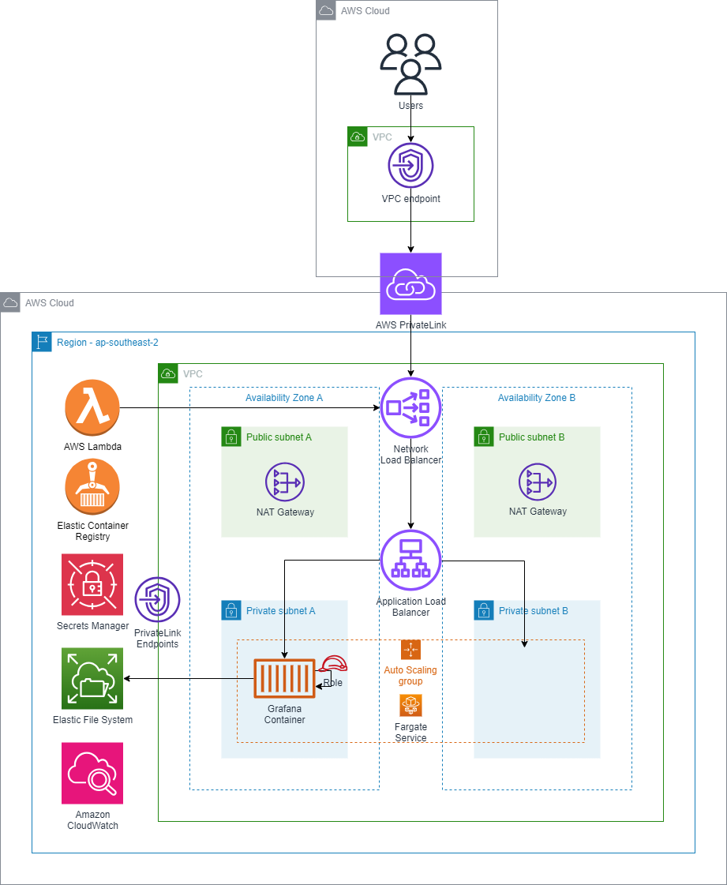

# Grafana Enterprise


## Summary
This project aims to deploy a resilient Grafana container on [AWS Fargate](https://aws.amazon.com/fargate/) using the [Grafana Enterprise Docker Image](https://grafana.com/docs/grafana/latest/installation/docker/).

In this solution, Grafana Enterpise is privately hosted using a Docker container application on Amazon Elastic Container Service (Amazon ECS) behind a Network Load Balancer, and the application accessed using AWS PrivateLink. You can then use a private network to securely access services on the Amazon Web Services (AWS) Cloud. Amazon Elastic File System (Amazon EFS) is used if the application requires persistent storage.

* [Terraform](https://www.terraform.io/) is used for infrastructure-as-code and deployment.  
* Persistance is provided by [Amazon EFS and AWS Fargate support](https://aws.amazon.com/about-aws/whats-new/2020/04/amazon-ecs-aws-fargate-support-amazon-efs-filesystems-generally-available/).  
* High Availability is supported but Autoscaling of the container is not provided at this point i.e. the ECS/Fargate service will ensure that only **one** Grafana container is online between Availability Zone A or B. 
* Access for the Grafana container to CloudWatch is configured with an IAM Role, preventing the need to configure Access/Secret keys
* The initial admin password is securely generated and configured using [Secrets Manager](https://console.aws.amazon.com/secretsmanager)
* A TLS certificate is automatically created deployed to the Application Load Balancer using [AWS Certificate Manager](https://aws.amazon.com/certificate-manager/) enabling secure HTTPS Only communication with the Grafana portal
* PrivateLink endpoints can be added for increased security

## System Diagram
* Access to Grafana dashboards - via internet or internal network?



## Prerequisites

### AWS requirements
Grafana Enterprise requires these AWS resources:
* Amazon CloudWatch
* EFS (Elastic File System)
* AWS KMS
* AWS Secrets Manager
* AWS Elastic Container Registry
* AWS IAM role - ECS task role

### Hardware recommendations
Grafana requires the minimum system resources:
* Minimum recommended memory: 512 MB
* Minimum recommended CPU: 1

Some features might require more memory or CPUs, including:
* Server side rendering of images
* Alerting
* Data source proxy

### PrivateLink Endpoints
PrivateLink endpoints can be added using the following command. This will incur additional cost for the endpoints, but will prevent Amazon CloudWatch, EFS (Elastic File System) and Secrets Manager traffic from traversing the public internet.

## AWS IAM - ECS Task Role

Role name: application-observability-ecs-grafana-enterprise
Description: Allows ECS to create and manage AWS resources on your behalf.

### AWS IAM - ECS Task Role - Trust Policy

```json
{
    "Version": "2008-10-17",
    "Statement": [
        {
            "Sid": "",
            "Effect": "Allow",
            "Principal": {
                "Service": "ecs-tasks.amazonaws.com"
            },
            "Action": "sts:AssumeRole",
            "Condition": {
                "ArnLike": {
                    "aws:SourceArn": "arn:aws:ecs:ap-southeast-2:851725631136:*"
                },
                "StringEquals": {
                    "aws:SourceAccount": "851725631136"
                }
            }
        }
    ]
}
```

### AWS IAM - ECS Task Role - Permissions (TODO: reduce for production)

AWS managed policy
* AmazonEC2ContainerServiceRole
* AmazonSSMManagedInstanceCore
* SecretsManagerReadWrite (TODO: reduce for production)
* CloudWatchFullAccess (TODO: reduce for production)

AWS custom policy
```json
{
	"Version": "2012-10-17",
	"Statement": [
		{
			"Effect": "Allow",
			"Action": [
				"ssm:GetParameters",
				"secretsmanager:GetSecretValue"
			],
			"Resource": [
				"arn:aws:ssm:ap-southeast-2:851725631136:parameter/grafanaEnterprise*",
				"arn:aws:secretsmanager:ap-southeast-2:851725631136:secret:grafanaEnterprise*"
			],
			"Condition": {
				"ArnLike": {
					"aws:SourceArn": "arn:aws:ecs:ap-southeast-2:851725631136:*"
				},
				"StringEquals": {
					"aws:SourceAccount": "851725631136"
				}
			}
		},
		{
			"Effect": "Allow",
			"Action": [
				"cloudwatch:Describe*",
                "cloudwatch:Get*",
				"cloudwatch:List*",
                "ec2:Describe*",
                "tag:GetResources"
			],
			"Resource": ["*"],
		}
	]
}
```

### AWS IAM - ECS Execution Role - Permissions (TODO: reduce for production)

AWS managed policy
* AmazonEC2ContainerServiceRole
* AmazonSSMManagedInstanceCore
* SecretsManagerReadWrite (TODO: reduce for production)
* CloudWatchFullAccess (TODO: reduce for production)

AWS custom policy
```json
{
	"Version": "2012-10-17",
	"Statement": [
		{
			"Effect": "Allow",
			"Action": [
				"ssm:GetParameters",
				"secretsmanager:GetSecretValue"
			],
			"Resource": [
				"arn:aws:ssm:ap-southeast-2:851725631136:parameter/grafanaEnterprise*",
				"arn:aws:secretsmanager:ap-southeast-2:851725631136:secret:grafanaEnterprise*"
			],
			"Condition": {
				"ArnLike": {
					"aws:SourceArn": "arn:aws:ecs:ap-southeast-2:851725631136:*"
				},
				"StringEquals": {
					"aws:SourceAccount": "851725631136"
				}
			}
		},
		{
			"Effect": "Allow",
			"Action": [
				"cloudwatch:Describe*",
                "cloudwatch:Get*",
				"cloudwatch:List*",
                "ec2:Describe*",
                "tag:GetResources"
			],
			"Resource": ["*"],
		}
	]
}
```

## Amazon EFS client

The [Amazon EFS client](https://github.com/aws/efs-utils) (amazon-efs-utils) is an open-source collection of Amazon EFS tools.

## Configure Grafana Enterprise

### Plugins and data

#### ServiceNow data source for Grafana
The ServiceNow data source plugin allows you to query and visualize data from ServiceNow within Grafana.

## Container details
| Container registry | Amazon ECR |
| Container image URI | 851725631136.dkr.ecr.ap-southeast-2.amazonaws.com/observability-hub:latest |

## Runtime environment variables
| Format or Source | Name | Value |
| -- | -- | -- |
| Plain text | GF_AUTH_ANONYMOUS_ORG_NAME | Observibot |
| Plain text | GF_WHITE_LABELING_APP_TITLE | HeyTaxi |
| Plain text | GF_WHITE_LABELING_LOGIN_BACKGROUND | url(http://www.bhmpics.com/wallpapers/starfield-1920x1080.jpg) |

## Useful Resources

### Grafana
* [Configure Grafana](https://grafana.com/docs/grafana/latest/setup-grafana/configure-grafana/)
* [Configure Grafana Enterprise](https://grafana.com/docs/grafana/latest/setup-grafana/configure-grafana/enterprise-configuration/)
* [Install Grafana](https://grafana.com/docs/grafana/latest/setup-grafana/installation/)
* [Docker Hub](https://hub.docker.com/r/grafana/grafana-enterprise)

### AWS
* [Pushing a Docker image to an Amazon ECR private repository](https://docs.aws.amazon.com/AmazonECR/latest/userguide/docker-push-ecr-image.html)
* [Securing Amazon ECS workloads on AWS Fargate with customer managed keys](https://aws.amazon.com/blogs/compute/securing-amazon-ecs-workloads-on-aws-fargate-with-customer-managed-keys/)
* [Activate a Grafana Enterprise license from AWS Marketplace on ECS](https://grafana.com/docs/grafana/latest/administration/enterprise-licensing/activate-aws-marketplace-license/activate-license-on-ecs/)
* [Managing Secrets for Amazon ECS Applications Using Parameter Store and IAM Roles for Tasks](https://aws.amazon.com/blogs/compute/managing-secrets-for-amazon-ecs-applications-using-parameter-store-and-iam-roles-for-tasks/)
* [Access container applications privately on Amazon ECS by using AWS PrivateLink and a Network Load Balancer](https://docs.aws.amazon.com/prescriptive-guidance/latest/patterns/access-container-applications-privately-on-amazon-ecs-by-using-aws-privatelink-and-a-network-load-balancer.html)

### AWS CLI
* [KMS create-key](https://awscli.amazonaws.com/v2/documentation/api/latest/reference/kms/create-key.html)
* [ECS create-cluster](https://docs.aws.amazon.com/cli/latest/reference/ecs/create-cluster.html)

### Terraform
* [Resource: aws_ecs_task_definition](https://registry.terraform.io/providers/hashicorp/aws/latest/docs/resources/ecs_task_definition)

### Related Blog Posts
* [Medium - Deploying Grafana with AWS Fargate (using CloudFormation)](https://andepaulj.medium.com/deploying-grafana-with-aws-fargate-f6061cc5e61d)
* [CDK Grafana](https://github.com/aws-samples/aws-cdk-grafana/blob/main/lib/cdk-grafana-stack.ts)
